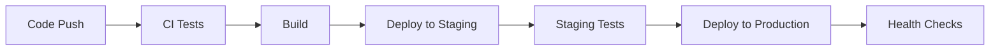

## Testing and Deployment

Final testing phase and production deployment setup.

### Testing Checklist

#### Automated Testing
- [ ] Unit tests for all critical functions
- [ ] Integration tests for API endpoints
- [ ] E2E tests for user workflows
- [ ] Performance testing
- [ ] Security testing

#### Manual Testing
- [ ] Cross-browser compatibility
- [ ] Mobile responsiveness
- [ ] Accessibility testing
- [ ] User acceptance testing
- [ ] Load testing

### Deployment Pipeline



### Infrastructure

- **Hosting**: AWS/Vercel for frontend, Railway/Heroku for backend
- **Database**: PostgreSQL with automated backups
- **CDN**: CloudFront for static asset delivery
- **Monitoring**: Application performance monitoring
- **Logging**: Centralized logging with error tracking

### Go-Live Checklist

- [ ] Domain name and SSL certificates
- [ ] Database migration scripts
- [ ] Environment variables configured
- [ ] Monitoring and alerts set up
- [ ] Backup and recovery procedures
- [ ] Documentation updated
- [ ] Team training completed

### Post-Launch

- Monitor application performance
- Gather user feedback
- Plan iteration improvements
- Security updates and maintenance

This marks the completion of our web development project! 🚀

---

## DESIGN ARTIFACTS (Designer Output)

### 1. Definition of Done (DoD)

#### 1.1 Automated Testing
- [ ] Unit test coverage ≥ 80% for critical business logic
- [ ] All unit tests pass without errors
- [ ] Integration tests cover all API endpoints
- [ ] Integration tests validate request/response contracts
- [ ] E2E tests cover critical user workflows (login, purchase, order)
- [ ] Performance tests show response times meet targets (< 2s average)
- [ ] Security tests completed with no critical vulnerabilities
- [ ] Load tests validate concurrent user capacity (min 100 users)
- [ ] All test environments (unit, integration, e2e) run successfully

#### 1.2 Manual Testing
- [ ] Cross-browser testing completed (Chrome, Firefox, Safari, Edge)
- [ ] Mobile responsiveness verified on iOS and Android
- [ ] Accessibility audit passes WCAG 2.1 AA standards
- [ ] User acceptance testing completed with stakeholders
- [ ] Load testing performed with realistic traffic patterns
- [ ] Regression testing confirms no existing features broken

#### 1.3 CI/CD Pipeline
- [ ] CI pipeline runs on every pull request
- [ ] All tests execute automatically in CI
- [ ] Build process completes without errors
- [ ] Code quality checks pass (linting, type-checking)
- [ ] Automated deployment to staging on branch merge
- [ ] Automated deployment to production on main branch (manual trigger)
- [ ] Rollback mechanism tested and working

#### 1.4 Infrastructure & Deployment
- [ ] Staging environment deployed and accessible
- [ ] Production environment deployed and accessible
- [ ] Domain name configured with SSL certificates
- [ ] Database migrations tested and documented
- [ ] Environment variables configured in all environments
- [ ] CDN configured for static asset delivery
- [ ] Database backup automation configured
- [ ] Monitoring and alerting systems operational

#### 1.5 Security & Compliance
- [ ] Security scan completed (OWASP vulnerabilities)
- [ ] Dependencies audited for vulnerabilities
- [ ] Authentication and authorization working correctly
- [ ] Data encryption at rest and in transit
- [ ] GDPR/privacy compliance verified
- [ ] Rate limiting configured on API endpoints
- [ ] CORS policies configured correctly

#### 1.6 Performance
- [ ] Lighthouse score ≥ 90 for Performance
- [ ] First Contentful Paint (FCP) < 1.5s
- [ ] Largest Contentful Paint (LCP) < 2.5s
- [ ] Cumulative Layout Shift (CLS) < 0.1
- [ ] Time to Interactive (TTI) < 3.5s
- [ ] API response times < 200ms (p50), < 1000ms (p99)
- [ ] Database query optimization completed

#### 1.7 Documentation & Training
- [ ] API documentation updated and published
- [ ] User documentation created
- [ ] Deployment runbook documented
- [ ] Troubleshooting guide created
- [ ] Team training completed for operations
- [ ] Incident response procedures documented

#### 1.8 Go-Live Checklist
- [ ] Production smoke tests passed
- [ ] Health check endpoints responding
- [ ] Error tracking configured (Sentry/similar)
- [ ] Analytics tracking configured
- [ ] Feature flags configured (if applicable)
- [ ] Customer support notified and trained
- [ ] Marketing/communications team ready
- [ ] Rollback plan documented and tested

---

### 2. Task Decomposition

This is an L-sized task that can be decomposed into the following subtasks:

| Subtask | Title | Size | Dependencies | Parallel? |
|---------|-------|------|--------------|-----------|
| 5.1 | Testing Infrastructure Setup | S | None | Can parallelize with 5.2 |
| 5.2 | CI/CD Pipeline Configuration | M | None | Can parallelize with 5.1 |
| 5.3 | Automated Test Suite Completion | L | 5.1, Frontend (4.x) | Sequential after 5.1 |
| 5.4 | Manual Testing & QA | M | 5.3 | Sequential after 5.3 |
| 5.5 | Infrastructure & Deployment Setup | L | None | Can parallelize early |
| 5.6 | Security & Performance Audit | M | 5.3, 5.5 | Sequential after 5.3, 5.5 |
| 5.7 | Documentation & Training | S | 5.5 | Can start after 5.5 |
| 5.8 | Production Deployment & Go-Live | M | All above | Final sequential step |

**Design Level Decision**: Interfaces will be designed at **parent level** because:
- Testing interfaces must be consistent across all test types (unit, integration, e2e)
- CI/CD configuration affects all subtasks
- Deployment configuration shared across environments
- Monitoring and logging interfaces must be standardized

---

### 3. Public Interface Definitions

#### 3.1 Test Configuration Types

```typescript
// tests/config/test-config.ts

/**
 * Base test configuration
 */
export interface TestConfig {
  testEnvironment: 'jsdom' | 'node';
  setupFiles: string[];
  setupFilesAfterEnv: string[];
  collectCoverageFrom: string[];
  coverageThreshold: CoverageThreshold;
  testTimeout: number;
}

/**
 * Coverage threshold configuration
 */
export interface CoverageThreshold {
  global: {
    branches: number;
    functions: number;
    lines: number;
    statements: number;
  };
}

/**
 * E2E test configuration
 */
export interface E2ETestConfig {
  baseURL: string;
  headless: boolean;
  viewport: { width: number; height: number };
  timeout: number;
  retries: number;
  screenshot: 'on' | 'off' | 'only-on-failure';
  video: 'on' | 'off' | 'retain-on-failure';
}

/**
 * Performance test thresholds
 */
export interface PerformanceThresholds {
  firstContentfulPaint: number;  // ms
  largestContentfulPaint: number; // ms
  cumulativeLayoutShift: number;
  timeToInteractive: number;      // ms
  totalBlockingTime: number;      // ms
}

/**
 * Load test configuration
 */
export interface LoadTestConfig {
  targetURL: string;
  virtualUsers: number;
  duration: number;              // seconds
  rampUpTime: number;            // seconds
  requestsPerSecond: number;
  thresholds: LoadTestThresholds;
}

/**
 * Load test thresholds
 */
export interface LoadTestThresholds {
  http_req_duration_p50: number;   // ms
  http_req_duration_p95: number;   // ms
  http_req_duration_p99: number;   // ms
  http_req_failed_rate: number;    // percentage
}
```

#### 3.2 Test Fixture Types

```typescript
// tests/fixtures/types.ts

/**
 * Test user fixture
 */
export interface TestUser {
  id: string;
  email: string;
  password: string;
  firstName: string;
  lastName: string;
  role: 'customer' | 'admin';
}

/**
 * Test product fixture
 */
export interface TestProduct {
  id: string;
  name: string;
  description: string;
  price: number;
  sku: string;
  stock: number;
  categoryId: string;
}

/**
 * Test order fixture
 */
export interface TestOrder {
  id: string;
  userId: string;
  items: Array<{ productId: string; quantity: number }>;
  total: number;
  status: 'pending' | 'confirmed' | 'shipped' | 'delivered';
}

/**
 * Test data factory interface
 */
export interface TestDataFactory {
  createUser(overrides?: Partial<TestUser>): TestUser;
  createProduct(overrides?: Partial<TestProduct>): TestProduct;
  createOrder(overrides?: Partial<TestOrder>): TestOrder;
  cleanup(): Promise<void>;
}
```

#### 3.3 CI/CD Configuration Types

```typescript
// .github/types/workflow-config.ts

/**
 * CI workflow configuration
 */
export interface CIWorkflowConfig {
  name: string;
  triggers: WorkflowTriggers;
  jobs: Record<string, CIJob>;
}

/**
 * Workflow triggers
 */
export interface WorkflowTriggers {
  push?: { branches: string[] };
  pull_request?: { branches: string[] };
  schedule?: Array<{ cron: string }>;
  workflow_dispatch?: Record<string, unknown>;
}

/**
 * CI job configuration
 */
export interface CIJob {
  name: string;
  runsOn: string;
  steps: CIStep[];
  needs?: string[];
  if?: string;
  timeout?: number;
}

/**
 * CI step configuration
 */
export interface CIStep {
  name: string;
  uses?: string;
  run?: string;
  with?: Record<string, string | number | boolean>;
  env?: Record<string, string>;
}

/**
 * Deployment configuration
 */
export interface DeploymentConfig {
  environment: 'staging' | 'production';
  provider: 'vercel' | 'aws' | 'railway' | 'heroku';
  region: string;
  buildCommand: string;
  outputDirectory: string;
  environmentVariables: Record<string, string>;
}
```

#### 3.4 Infrastructure Configuration Types

```typescript
// infrastructure/types/config.ts

/**
 * Environment configuration
 */
export interface EnvironmentConfig {
  name: 'development' | 'staging' | 'production';
  apiUrl: string;
  databaseUrl: string;
  redisUrl?: string;
  cdnUrl: string;
  frontendUrl: string;
  logLevel: 'debug' | 'info' | 'warn' | 'error';
}

/**
 * Database configuration
 */
export interface DatabaseConfig {
  host: string;
  port: number;
  database: string;
  username: string;
  password: string;
  ssl: boolean;
  poolSize: number;
  backupSchedule: string;  // cron expression
  backupRetentionDays: number;
}

/**
 * CDN configuration
 */
export interface CDNConfig {
  provider: 'cloudfront' | 'cloudflare' | 'fastly';
  distribution: string;
  origins: CDNOrigin[];
  caching: CDNCachingRules;
  compression: boolean;
}

/**
 * CDN origin configuration
 */
export interface CDNOrigin {
  id: string;
  domainName: string;
  path: string;
  customHeaders?: Record<string, string>;
}

/**
 * CDN caching rules
 */
export interface CDNCachingRules {
  defaultTTL: number;         // seconds
  maxTTL: number;             // seconds
  minTTL: number;             // seconds
  queryStringCaching: boolean;
  compressionEnabled: boolean;
}

/**
 * SSL certificate configuration
 */
export interface SSLConfig {
  provider: 'letsencrypt' | 'aws-acm' | 'custom';
  domains: string[];
  autoRenewal: boolean;
  certificateArn?: string;    // for AWS ACM
}
```

#### 3.5 Monitoring & Logging Types

```typescript
// infrastructure/types/monitoring.ts

/**
 * Monitoring configuration
 */
export interface MonitoringConfig {
  apm: APMConfig;
  logging: LoggingConfig;
  alerting: AlertingConfig;
  healthChecks: HealthCheckConfig[];
}

/**
 * Application Performance Monitoring config
 */
export interface APMConfig {
  provider: 'datadog' | 'newrelic' | 'elastic-apm';
  serviceName: string;
  environment: string;
  sampleRate: number;         // 0-1
  captureErrors: boolean;
  captureTraces: boolean;
}

/**
 * Logging configuration
 */
export interface LoggingConfig {
  provider: 'cloudwatch' | 'elasticsearch' | 'datadog';
  level: 'debug' | 'info' | 'warn' | 'error';
  format: 'json' | 'text';
  retention: number;          // days
  errorTracking: ErrorTrackingConfig;
}

/**
 * Error tracking configuration
 */
export interface ErrorTrackingConfig {
  provider: 'sentry' | 'rollbar' | 'bugsnag';
  dsn: string;
  environment: string;
  release?: string;
  sampleRate: number;         // 0-1
  tracesSampleRate: number;   // 0-1
}

/**
 * Alerting configuration
 */
export interface AlertingConfig {
  provider: 'pagerduty' | 'opsgenie' | 'slack';
  channels: AlertChannel[];
  rules: AlertRule[];
}

/**
 * Alert channel configuration
 */
export interface AlertChannel {
  id: string;
  name: string;
  type: 'email' | 'slack' | 'pagerduty' | 'webhook';
  endpoint: string;
  severity: Array<'low' | 'medium' | 'high' | 'critical'>;
}

/**
 * Alert rule configuration
 */
export interface AlertRule {
  name: string;
  metric: string;
  condition: 'above' | 'below' | 'equals';
  threshold: number;
  duration: number;           // seconds
  channels: string[];         // channel IDs
  severity: 'low' | 'medium' | 'high' | 'critical';
}

/**
 * Health check configuration
 */
export interface HealthCheckConfig {
  name: string;
  endpoint: string;
  method: 'GET' | 'POST' | 'HEAD';
  interval: number;           // seconds
  timeout: number;            // seconds
  expectedStatus: number;
  expectedBody?: string;
  alertOnFailure: boolean;
}

/**
 * Health check response
 */
export interface HealthCheckResponse {
  status: 'healthy' | 'degraded' | 'unhealthy';
  timestamp: string;
  checks: HealthCheckResult[];
  version: string;
  uptime: number;             // seconds
}

/**
 * Individual health check result
 */
export interface HealthCheckResult {
  name: string;
  status: 'pass' | 'fail' | 'warn';
  message?: string;
  duration: number;           // ms
  timestamp: string;
}
```

#### 3.6 Deployment Scripts Interface

```typescript
// scripts/types/deployment.ts

/**
 * Deployment script options
 */
export interface DeploymentOptions {
  environment: 'staging' | 'production';
  skipTests?: boolean;
  skipBackup?: boolean;
  dryRun?: boolean;
  rollbackOnFailure?: boolean;
  notifyChannels?: string[];
}

/**
 * Migration script options
 */
export interface MigrationOptions {
  direction: 'up' | 'down';
  target?: string;            // specific migration version
  dryRun?: boolean;
  force?: boolean;
}

/**
 * Database backup options
 */
export interface BackupOptions {
  database: string;
  destination: string;
  compress: boolean;
  encrypt?: boolean;
  retention?: number;         // days
}

/**
 * Rollback options
 */
export interface RollbackOptions {
  targetVersion: string;
  skipBackup?: boolean;
  force?: boolean;
}

/**
 * Deployment result
 */
export interface DeploymentResult {
  success: boolean;
  environment: string;
  version: string;
  deployedAt: string;
  duration: number;           // seconds
  logs: string[];
  errors?: string[];
}
```

#### 3.7 Security Test Configuration

```typescript
// tests/security/types.ts

/**
 * Security scan configuration
 */
export interface SecurityScanConfig {
  scanners: SecurityScanner[];
  ignorePatterns: string[];
  severityThreshold: 'low' | 'medium' | 'high' | 'critical';
}

/**
 * Security scanner configuration
 */
export interface SecurityScanner {
  name: 'owasp-zap' | 'snyk' | 'npm-audit' | 'trivy';
  enabled: boolean;
  config: Record<string, unknown>;
}

/**
 * Security scan result
 */
export interface SecurityScanResult {
  scanner: string;
  timestamp: string;
  vulnerabilities: Vulnerability[];
  summary: VulnerabilitySummary;
}

/**
 * Vulnerability details
 */
export interface Vulnerability {
  id: string;
  title: string;
  severity: 'low' | 'medium' | 'high' | 'critical';
  description: string;
  affectedPackage?: string;
  affectedVersion?: string;
  fixedVersion?: string;
  cwe?: string[];
  cvss?: number;
  recommendation: string;
}

/**
 * Vulnerability summary
 */
export interface VulnerabilitySummary {
  total: number;
  critical: number;
  high: number;
  medium: number;
  low: number;
}
```

---

### 4. Test Skeleton

#### 4.1 Performance Test Suite

```typescript
// tests/performance/lighthouse.test.ts

import { describe, it, expect } from 'vitest';

describe('Lighthouse Performance Tests', () => {
  it('homepage meets performance thresholds', async () => {
    // TODO: Coder implements
    // 1. Run Lighthouse audit on homepage
    // 2. Assert FCP < 1.5s
    // 3. Assert LCP < 2.5s
    // 4. Assert CLS < 0.1
    // 5. Assert TTI < 3.5s
    // 6. Assert Performance score >= 90
  });

  it('product listing page meets performance thresholds', async () => {
    // TODO: Coder implements
  });

  it('product detail page meets performance thresholds', async () => {
    // TODO: Coder implements
  });

  it('checkout page meets performance thresholds', async () => {
    // TODO: Coder implements
  });
});
```

```typescript
// tests/performance/load-test.ts

import { describe, it, expect } from 'vitest';

describe('Load Tests', () => {
  it('handles 100 concurrent users on homepage', async () => {
    // TODO: Coder implements using k6 or artillery
    // 1. Ramp up to 100 users over 30s
    // 2. Maintain 100 users for 2 minutes
    // 3. Assert p50 response time < 200ms
    // 4. Assert p95 response time < 1000ms
    // 5. Assert error rate < 1%
  });

  it('handles product search under load', async () => {
    // TODO: Coder implements
  });

  it('handles checkout flow under load', async () => {
    // TODO: Coder implements
  });

  it('API endpoints meet response time SLAs', async () => {
    // TODO: Coder implements
    // Test each critical API endpoint
  });
});
```

#### 4.2 Security Test Suite

```typescript
// tests/security/vulnerability-scan.test.ts

import { describe, it, expect } from 'vitest';

describe('Security Vulnerability Scans', () => {
  it('npm dependencies have no critical vulnerabilities', async () => {
    // TODO: Coder implements
    // Run npm audit and assert no critical/high vulnerabilities
  });

  it('OWASP top 10 vulnerabilities not present', async () => {
    // TODO: Coder implements
    // Run OWASP ZAP or similar scanner
  });

  it('authentication endpoints are secure', async () => {
    // TODO: Coder implements
    // Test for SQL injection, XSS, CSRF
  });

  it('sensitive data is not exposed in responses', async () => {
    // TODO: Coder implements
    // Assert no passwords, tokens in API responses
  });

  it('rate limiting is enforced', async () => {
    // TODO: Coder implements
    // Test rate limit on login endpoint
  });

  it('CORS policy is correctly configured', async () => {
    // TODO: Coder implements
  });

  it('headers include security best practices', async () => {
    // TODO: Coder implements
    // Check for HSTS, CSP, X-Frame-Options, etc.
  });
});
```

```typescript
// tests/security/penetration-test.ts

import { describe, it, expect } from 'vitest';

describe('Penetration Tests', () => {
  it('SQL injection attempts are blocked', async () => {
    // TODO: Coder implements
  });

  it('XSS attempts are sanitized', async () => {
    // TODO: Coder implements
  });

  it('CSRF tokens are validated', async () => {
    // TODO: Coder implements
  });

  it('unauthorized access is prevented', async () => {
    // TODO: Coder implements
    // Try accessing protected endpoints without auth
  });

  it('privilege escalation is prevented', async () => {
    // TODO: Coder implements
    // Try accessing admin endpoints as regular user
  });
});
```

#### 4.3 Cross-Browser Compatibility Tests

```typescript
// tests/e2e/cross-browser.spec.ts

import { test, expect } from '@playwright/test';

test.describe('Cross-Browser Compatibility', () => {
  test('login works in Chrome', async ({ browser }) => {
    // TODO: Coder implements
  });

  test('login works in Firefox', async ({ browser }) => {
    // TODO: Coder implements
  });

  test('login works in Safari', async ({ browser }) => {
    // TODO: Coder implements
  });

  test('shopping cart works across all browsers', async ({ browser }) => {
    // TODO: Coder implements
  });

  test('responsive layout works on mobile viewports', async ({ page }) => {
    // TODO: Coder implements
    // Test on iPhone, Android viewports
  });

  test('responsive layout works on tablet viewports', async ({ page }) => {
    // TODO: Coder implements
  });
});
```

#### 4.4 Accessibility Test Suite

```typescript
// tests/accessibility/wcag-compliance.test.ts

import { describe, it, expect } from 'vitest';
import { axe, toHaveNoViolations } from 'jest-axe';

expect.extend(toHaveNoViolations);

describe('WCAG 2.1 AA Compliance', () => {
  it('all pages pass axe accessibility scan', async () => {
    // TODO: Coder implements
    // Test all major pages
  });

  it('keyboard navigation works throughout app', async () => {
    // TODO: Coder implements
    // Tab through entire flow
  });

  it('screen reader announces content correctly', async () => {
    // TODO: Coder implements
  });

  it('color contrast meets WCAG AA standards', async () => {
    // TODO: Coder implements
  });

  it('form labels are properly associated', async () => {
    // TODO: Coder implements
  });

  it('ARIA attributes are used correctly', async () => {
    // TODO: Coder implements
  });

  it('focus management works in modals', async () => {
    // TODO: Coder implements
  });

  it('skip links are present and functional', async () => {
    // TODO: Coder implements
  });
});
```

#### 4.5 Smoke Tests

```typescript
// tests/smoke/production-smoke.test.ts

import { describe, it, expect } from 'vitest';

describe('Production Smoke Tests', () => {
  it('homepage loads successfully', async () => {
    // TODO: Coder implements
  });

  it('API health check endpoint responds', async () => {
    // TODO: Coder implements
  });

  it('database connection is healthy', async () => {
    // TODO: Coder implements
  });

  it('CDN serves static assets', async () => {
    // TODO: Coder implements
  });

  it('SSL certificate is valid', async () => {
    // TODO: Coder implements
  });

  it('user can complete critical path (login -> browse -> cart)', async () => {
    // TODO: Coder implements
  });

  it('monitoring endpoints are accessible', async () => {
    // TODO: Coder implements
  });

  it('error tracking is capturing errors', async () => {
    // TODO: Coder implements
  });
});
```

#### 4.6 Infrastructure Tests

```typescript
// tests/infrastructure/health-checks.test.ts

import { describe, it, expect } from 'vitest';

describe('Infrastructure Health Checks', () => {
  it('API server is running and responsive', async () => {
    // TODO: Coder implements
  });

  it('database is accessible and queryable', async () => {
    // TODO: Coder implements
  });

  it('cache/Redis is operational', async () => {
    // TODO: Coder implements
  });

  it('CDN is serving content correctly', async () => {
    // TODO: Coder implements
  });

  it('backup jobs are running on schedule', async () => {
    // TODO: Coder implements
  });

  it('monitoring agent is reporting metrics', async () => {
    // TODO: Coder implements
  });

  it('log aggregation is working', async () => {
    // TODO: Coder implements
  });
});
```

---

### 5. Affected Scope

#### 5.1 Files to Create

**Testing Configuration:**
```
tests/
├── config/
│   ├── test-config.ts              # Test configuration
│   ├── vitest.setup.ts             # Vitest setup
│   ├── playwright.setup.ts         # Playwright setup
│   └── jest-axe.setup.ts           # Accessibility testing setup
│
├── fixtures/
│   ├── types.ts                    # Test fixture types
│   ├── users.ts                    # User test data
│   ├── products.ts                 # Product test data
│   ├── orders.ts                   # Order test data
│   └── factory.ts                  # Test data factory
│
├── performance/
│   ├── lighthouse.test.ts          # Lighthouse performance tests
│   ├── load-test.ts                # Load testing with k6/artillery
│   └── api-performance.test.ts     # API endpoint performance
│
├── security/
│   ├── vulnerability-scan.test.ts  # Dependency vulnerability scans
│   ├── penetration-test.ts         # Security penetration tests
│   └── owasp-scan.test.ts          # OWASP top 10 tests
│
├── e2e/
│   ├── cross-browser.spec.ts       # Cross-browser compatibility
│   ├── mobile-responsive.spec.ts   # Mobile responsiveness tests
│   └── user-acceptance.spec.ts     # UAT scenarios
│
├── accessibility/
│   ├── wcag-compliance.test.ts     # WCAG 2.1 AA compliance
│   ├── keyboard-navigation.test.ts # Keyboard accessibility
│   └── screen-reader.test.ts       # Screen reader testing
│
├── smoke/
│   ├── production-smoke.test.ts    # Production smoke tests
│   └── staging-smoke.test.ts       # Staging smoke tests
│
└── infrastructure/
    ├── health-checks.test.ts       # Infrastructure health checks
    └── backup-restore.test.ts      # Backup/restore validation
```

**CI/CD Configuration:**
```
.github/
├── workflows/
│   ├── ci.yml                      # Main CI workflow
│   ├── deploy-staging.yml          # Staging deployment
│   ├── deploy-production.yml       # Production deployment
│   ├── security-scan.yml           # Security scanning workflow
│   ├── performance-test.yml        # Performance testing workflow
│   └── backup.yml                  # Automated backup workflow
│
└── types/
    └── workflow-config.ts          # CI/CD type definitions
```

**Infrastructure Configuration:**
```
infrastructure/
├── types/
│   ├── config.ts                   # Infrastructure types
│   ├── monitoring.ts               # Monitoring types
│   └── deployment.ts               # Deployment types
│
├── terraform/                      # Infrastructure as Code (if using AWS)
│   ├── main.tf
│   ├── variables.tf
│   ├── outputs.tf
│   ├── staging/
│   │   └── terraform.tfvars
│   └── production/
│       └── terraform.tfvars
│
├── docker/
│   ├── Dockerfile                  # Application container
│   ├── Dockerfile.nginx            # Nginx reverse proxy
│   └── docker-compose.yml          # Local development stack
│
├── k8s/                           # Kubernetes manifests (if applicable)
│   ├── deployment.yaml
│   ├── service.yaml
│   ├── ingress.yaml
│   └── configmap.yaml
│
└── monitoring/
    ├── prometheus.yml              # Prometheus config
    ├── grafana-dashboards/         # Grafana dashboard JSONs
    └── alerting-rules.yml          # Alert rules
```

**Deployment Scripts:**
```
scripts/
├── types/
│   └── deployment.ts               # Deployment script types
│
├── deploy-staging.sh               # Deploy to staging
├── deploy-production.sh            # Deploy to production
├── rollback.sh                     # Rollback deployment
├── migrate-database.ts             # Database migration runner
├── backup-database.sh              # Database backup script
├── restore-database.sh             # Database restore script
├── health-check.sh                 # Health check script
└── smoke-test.sh                   # Smoke test runner
```

**Configuration Files:**
```
project-root/
├── .env.example                    # Environment variables template
├── .env.staging                    # Staging environment vars (gitignored)
├── .env.production                 # Production environment vars (gitignored)
│
├── k6.config.js                    # k6 load testing config
├── artillery.yml                   # Artillery load testing config
├── lighthouse.config.js            # Lighthouse config
│
├── sentry.config.ts                # Error tracking config
├── datadog.config.ts               # APM config
│
└── deployment/
    ├── staging.json                # Staging deployment config
    └── production.json             # Production deployment config
```

**Documentation:**
```
docs/
├── deployment/
│   ├── README.md                   # Deployment overview
│   ├── staging-deployment.md       # Staging deployment guide
│   ├── production-deployment.md    # Production deployment guide
│   ├── rollback-procedure.md       # Rollback procedures
│   └── troubleshooting.md          # Troubleshooting guide
│
├── testing/
│   ├── test-strategy.md            # Testing strategy overview
│   ├── running-tests.md            # How to run tests
│   ├── writing-tests.md            # Test writing guidelines
│   └── test-coverage.md            # Coverage requirements
│
├── operations/
│   ├── monitoring.md               # Monitoring setup
│   ├── logging.md                  # Logging configuration
│   ├── alerting.md                 # Alert management
│   ├── incident-response.md        # Incident response procedures
│   └── backup-recovery.md          # Backup and recovery guide
│
└── security/
    ├── security-checklist.md       # Security checklist
    ├── vulnerability-management.md # Vulnerability process
    └── compliance.md               # Compliance requirements
```

#### 5.2 Files to Modify

**Update existing configuration files:**
- `package.json` - Add test and deployment scripts
- `vite.config.ts` - Add production build optimizations
- `tsconfig.json` - Add paths for test files
- `.gitignore` - Add environment files, test artifacts
- `README.md` - Add testing and deployment instructions

**Update frontend application:**
- `src/main.tsx` - Add error tracking initialization (Sentry)
- `src/App.tsx` - Add performance monitoring
- `src/services/api/base.ts` - Add request logging for monitoring

---

### 6. Architecture Decisions

#### 6.1 Testing Strategy

**Test Pyramid:**
```
        E2E Tests (10%)
      /              \
   Integration (30%)
  /                   \
Unit Tests (60%)
```

- **Unit Tests**: Fast, isolated, high coverage
- **Integration Tests**: API contracts, service interactions
- **E2E Tests**: Critical user paths only

**Tools:**
- Unit/Integration: Vitest + React Testing Library
- E2E: Playwright (cross-browser)
- Performance: Lighthouse, k6
- Security: npm audit, OWASP ZAP, Snyk
- Accessibility: jest-axe, Pa11y

#### 6.2 CI/CD Strategy

**Pipeline Stages:**
1. **Commit**: Lint, type-check, unit tests
2. **PR**: Full test suite, security scan
3. **Merge to dev**: Deploy to staging
4. **Merge to main**: Manual production deploy

**Branch Strategy:**
- `main` → Production
- `dev` → Staging
- `feature/*` → Feature branches

**Deployment:**
- Staging: Automatic on merge to dev
- Production: Manual trigger with approval

#### 6.3 Infrastructure Strategy

**Environments:**
- **Development**: Local with Docker Compose
- **Staging**: Cloud environment (matches production)
- **Production**: Cloud environment (high availability)

**Hosting Options:**
- **Frontend**: Vercel (recommended) or AWS S3 + CloudFront
- **Backend**: Railway (recommended) or AWS ECS/Fargate
- **Database**: Railway Postgres or AWS RDS
- **CDN**: Built-in (Vercel) or CloudFront

**Why Vercel + Railway:**
- Zero-config deployments
- Automatic HTTPS
- Preview deployments for PRs
- Built-in monitoring
- Cost-effective for small to medium projects

#### 6.4 Monitoring Strategy

**Application Performance Monitoring:**
- Tool: Datadog or New Relic
- Metrics: Response times, error rates, throughput
- Traces: Request flow through services

**Error Tracking:**
- Tool: Sentry
- Capture: Unhandled exceptions, API errors
- Context: User info, request data, breadcrumbs

**Logging:**
- Tool: CloudWatch or Datadog Logs
- Levels: error, warn, info, debug
- Structure: JSON format for parsing

**Alerting:**
- Critical: Page on-call (PagerDuty)
- High: Slack notification
- Medium/Low: Email digest

#### 6.5 Deployment Strategy

**Blue-Green Deployment:**
- Two identical production environments
- Route traffic to new version
- Instant rollback if issues

**Database Migrations:**
- Run before deployment
- Backward-compatible changes only
- Test on staging first

**Rollback Plan:**
- Keep previous 3 versions deployable
- Automated rollback on health check failure
- Manual rollback command available

#### 6.6 Security Strategy

**Defense in Depth:**
1. **Network**: HTTPS only, CORS, rate limiting
2. **Application**: Input validation, sanitization, auth
3. **Data**: Encryption at rest and in transit
4. **Monitoring**: Security alerts, audit logs

**Vulnerability Management:**
- Weekly dependency scans
- Monthly security audits
- Immediate patching of critical issues

---

### 7. Configuration Examples

#### 7.1 GitHub Actions CI Workflow

```yaml
# .github/workflows/ci.yml

name: CI Pipeline

on:
  pull_request:
    branches: [main, dev]
  push:
    branches: [main, dev]

jobs:
  test:
    name: Run Tests
    runs-on: ubuntu-latest

    steps:
      - name: Checkout code
        uses: actions/checkout@v3

      - name: Setup Node.js
        uses: actions/setup-node@v3
        with:
          node-version: '18'
          cache: 'npm'

      - name: Install dependencies
        run: npm ci

      - name: Run linting
        run: npm run lint

      - name: Run type checking
        run: npm run type-check

      - name: Run unit tests
        run: npm run test:unit

      - name: Run integration tests
        run: npm run test:integration

      - name: Run E2E tests
        run: npm run test:e2e

      - name: Upload coverage
        uses: codecov/codecov-action@v3
        with:
          files: ./coverage/coverage-final.json

  security:
    name: Security Scan
    runs-on: ubuntu-latest

    steps:
      - name: Checkout code
        uses: actions/checkout@v3

      - name: Run npm audit
        run: npm audit --audit-level=moderate

      - name: Run Snyk scan
        uses: snyk/actions/node@master
        env:
          SNYK_TOKEN: ${{ secrets.SNYK_TOKEN }}
```

#### 7.2 Deployment Configuration

```typescript
// deployment/production.json

{
  "environment": "production",
  "provider": "vercel",
  "region": "us-east-1",
  "buildCommand": "npm run build",
  "outputDirectory": "dist",
  "environmentVariables": {
    "VITE_API_URL": "https://api.example.com",
    "VITE_SENTRY_DSN": "${SENTRY_DSN}",
    "VITE_ENV": "production"
  },
  "healthCheck": {
    "path": "/health",
    "interval": 30,
    "timeout": 5
  },
  "scaling": {
    "minInstances": 2,
    "maxInstances": 10
  }
}
```

#### 7.3 Monitoring Configuration

```typescript
// sentry.config.ts

import * as Sentry from '@sentry/react';

export const initSentry = () => {
  Sentry.init({
    dsn: import.meta.env.VITE_SENTRY_DSN,
    environment: import.meta.env.VITE_ENV,
    tracesSampleRate: 0.1,
    replaysSessionSampleRate: 0.1,
    replaysOnErrorSampleRate: 1.0,
    integrations: [
      new Sentry.BrowserTracing(),
      new Sentry.Replay(),
    ],
  });
};
```

---

### 8. Deployment Checklist

#### 8.1 Pre-Deployment Validation

**Code Quality:**
- [ ] All CI tests passing
- [ ] No critical/high security vulnerabilities
- [ ] Code review approved
- [ ] Performance benchmarks met
- [ ] Test coverage ≥ 80%

**Configuration:**
- [ ] Environment variables set correctly
- [ ] Database migrations tested
- [ ] Feature flags configured
- [ ] CDN cache rules configured
- [ ] SSL certificates valid

**Documentation:**
- [ ] Deployment runbook updated
- [ ] API documentation current
- [ ] Changelog updated
- [ ] User documentation ready

#### 8.2 Deployment Execution

**Staging:**
1. Run database migrations
2. Deploy application
3. Run smoke tests
4. Verify monitoring/logging
5. Test critical user paths
6. Notify team

**Production:**
1. Create database backup
2. Run database migrations (if any)
3. Deploy to blue environment
4. Run smoke tests
5. Verify health checks passing
6. Route traffic to blue
7. Monitor for 15 minutes
8. Keep green environment for rollback

#### 8.3 Post-Deployment Validation

**Immediate (0-15 minutes):**
- [ ] Health checks passing
- [ ] No error spikes in Sentry
- [ ] API response times normal
- [ ] Critical user paths working

**Short-term (15-60 minutes):**
- [ ] Error rates below baseline
- [ ] Performance metrics stable
- [ ] Database query performance normal
- [ ] CDN hit rate acceptable

**Medium-term (1-24 hours):**
- [ ] User feedback reviewed
- [ ] Business metrics tracked
- [ ] No increase in support tickets
- [ ] Monitor for edge cases

---

### 9. Rollback Procedures

#### 9.1 Automated Rollback Triggers

- Health check failures > 3 consecutive
- Error rate > 5% for 5 minutes
- API p95 latency > 3s for 10 minutes
- Database connection failures

#### 9.2 Manual Rollback Steps

```bash
# 1. Trigger rollback script
./scripts/rollback.sh --environment production --version v1.2.3

# 2. Verify rollback successful
./scripts/health-check.sh --environment production

# 3. Monitor for stability
# Check Sentry, Datadog dashboards

# 4. Post-incident review
# Document what went wrong and how to prevent
```

---

### 10. Monitoring & Alerting Setup

#### 10.1 Key Metrics to Monitor

**Application Metrics:**
- Request rate (requests/second)
- Error rate (errors/total requests)
- Response time (p50, p95, p99)
- Availability (uptime %)

**Infrastructure Metrics:**
- CPU utilization
- Memory usage
- Disk I/O
- Network throughput

**Business Metrics:**
- User signups
- Orders placed
- Cart abandonment rate
- Revenue (if applicable)

#### 10.2 Alert Thresholds

| Metric | Warning | Critical | Action |
|--------|---------|----------|--------|
| Error Rate | > 1% | > 5% | Page on-call |
| API p95 Latency | > 1s | > 3s | Investigate |
| CPU Usage | > 70% | > 90% | Scale up |
| Memory Usage | > 80% | > 95% | Scale up |
| Disk Space | > 80% | > 90% | Clean up logs |

---

### 11. Testing Schedule

**Pre-Deployment (Dev Complete → Staging):**
- Day 1-2: Unit + Integration test completion
- Day 2-3: E2E test execution
- Day 3: Performance testing
- Day 4: Security scanning
- Day 4-5: UAT with stakeholders

**Staging Environment:**
- Day 5: Deploy to staging
- Day 5-6: Manual QA testing
- Day 6: Accessibility audit
- Day 6-7: Cross-browser testing
- Day 7: Load testing

**Production Deployment:**
- Day 7: Production deployment (low-traffic window)
- Day 7-14: Monitoring period
- Day 14: Retrospective

---

### 12. Success Criteria

**Technical Success:**
- All automated tests passing (100%)
- Test coverage ≥ 80%
- Zero critical security vulnerabilities
- Performance targets met
- Zero production incidents in first 48 hours

**Business Success:**
- User acceptance criteria met
- No critical bugs reported in first week
- System handles expected load
- User satisfaction positive
- Support ticket volume normal

**Operational Success:**
- Monitoring and alerting operational
- Team trained on operations
- Documentation complete
- Rollback procedures tested
- Incident response plan ready

---

## Next Steps for Manager

1. **Review and approve this design** - Ensure all requirements covered
2. **Decompose into subtasks** - Create 8 subtasks as outlined in Section 2
3. **Assign subtasks to Coder** - Prioritize 5.1, 5.2, 5.5 to start in parallel
4. **Set up infrastructure accounts** - Vercel, Railway, Sentry, etc.
5. **Schedule UAT sessions** - Coordinate with stakeholders
6. **Plan deployment windows** - Identify low-traffic times

**Dependencies:**
- Subtask 5.3 (Automated Tests) requires Frontend task (4.x) to be completed
- Subtask 5.4 (Manual Testing) requires 5.3 to be completed
- Subtask 5.6 (Security Audit) requires 5.3 and 5.5 to be completed
- Subtask 5.8 (Go-Live) requires all other subtasks to be completed

**Estimated Timeline:** 7-10 days with proper parallelization
